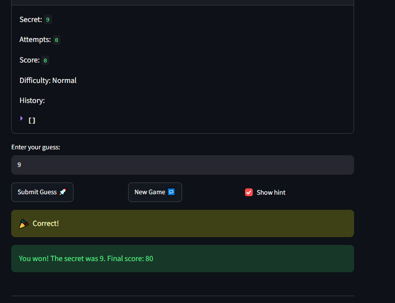

# 🎮 Game Glitch Investigator: The Impossible Guesser

## 🚨 The Situation

You asked an AI to build a simple "Number Guessing Game" using Streamlit.
It wrote the code, ran away, and now the game is unplayable. 

- You can't win.
- The hints lie to you.
- The secret number seems to have commitment issues.

## 🛠️ Setup

1. Install dependencies: `pip install -r requirements.txt`
2. Run the broken app: `python -m streamlit run app.py`

## 🕵️‍♂️ Your Mission

1. **Play the game.** Open the "Developer Debug Info" tab in the app to see the secret number. Try to win.
2. **Find the State Bug.** Why does the secret number change every time you click "Submit"? Ask ChatGPT: *"How do I keep a variable from resetting in Streamlit when I click a button?"*
3. **Fix the Logic.** The hints ("Higher/Lower") are wrong. Fix them.
4. **Refactor & Test.** - Move the logic into `logic_utils.py`.
   - Run `pytest` in your terminal.
   - Keep fixing until all tests pass!

## 📝 Document Your Experience
- [x] **Game's purpose:** A number guessing game built with Streamlit. You pick a difficulty, guess the secret number, and the game tells you to go higher or lower until you win or run out of attempts.
- [x] **Bugs found:**
  1. The hints were backwards ("Go HIGHER" when you needed to go lower).
  2. On even attempts the secret was turned into a string, so `"9" > "50"` gave the wrong hint.
  3. New Game didn't reset the game's status, so after a win or loss the game stayed stuck.
  4. Hard (1–50) had a smaller range than Normal (1–100).
- [x] **Fixes applied:**
  1. Swapped the hint messages in `check_guess()`.
  2. Removed the string conversion so the game always compares numbers.
  3. New Game now resets status, attempts, score and history, and picks the secret from the current difficulty's range.
  4. Set the ranges to Easy 1–20, Normal 1–50, Hard 1–100.
  5. Moved the logic into `logic_utils.py` and added pytest tests (11 passing).


## 📸 Demo Walkthrough

Describe your fixed game in numbered steps so a reader can follow along without watching a video:

   1. Fixed the backwards hints. In check_guess() the "Go HIGHER!" and "Go LOWER!" messages were swapped. I swapped them back, so a guess that's too low now says go higher and a guess that's too high says go lower.
2. Fixed the secret turning into text. On every even attempt the app converted the secret number into a string, so "9" > "50" was treated as true and the hint was wrong. I removed that conversion, so the game always compares numbers.
3. Fixed the New Game button. It didn't reset the game's status, so after a win or loss the game stayed stuck. It now resets status, attempts, score and history, and picks a new secret from the current difficulty's range.
5. Fixed the difficulty ranges. Hard (1–50) had a smaller range than Normal (1–100). I swapped them, so Easy is 1–20, Normal is 1–50 and Hard is 1–100.
6. Made attempts consistent. A new game, a difficulty change and the first page load now all start at 0 attempts, so you get the full number of guesses the sidebar shows.
Moved the logic into logic_utils.py and added tests. All 11 pytest tests pass.

**Game session (after the fixes)**

```
Difficulty: Normal | Secret (debug tab): 21 | Guess a number between 1 and 50. Attempts left: 8
Guess   1 -> Go HIGHER!
Guess  99 -> Go LOWER!
Guess  21 -> Correct! | You won! The secret was 21. Final score: 60
Clicked New Game -> new game started, status back to "playing" and I can guess again
```

**Screenshot** 

## 🧪 Test Results

```
$ pytest tests/ -v
collected 11 items

tests/test_game_logic.py::test_winning_guess PASSED
tests/test_game_logic.py::test_guess_too_high PASSED
tests/test_game_logic.py::test_guess_too_low PASSED
tests/test_game_logic.py::test_too_high_guess_says_go_lower PASSED
tests/test_game_logic.py::test_too_low_guess_says_go_higher PASSED
tests/test_game_logic.py::test_single_digit_guess_below_two_digit_secret_is_too_low PASSED
tests/test_game_logic.py::test_two_digit_guess_above_single_digit_secret_is_too_high PASSED
tests/test_game_logic.py::test_difficulty_ranges PASSED
tests/test_game_logic.py::test_harder_difficulty_has_larger_range PASSED
tests/test_game_logic.py::test_new_game_resets_status_after_finished_game PASSED
tests/test_game_logic.py::test_new_game_secret_respects_difficulty_range PASSED

============================= 11 passed in 0.02s ==============================

```

## 🚀 Stretch Features

- [ ] [If you choose to complete Challenge 4, describe the Enhanced UI changes here — a screenshot is optional]
